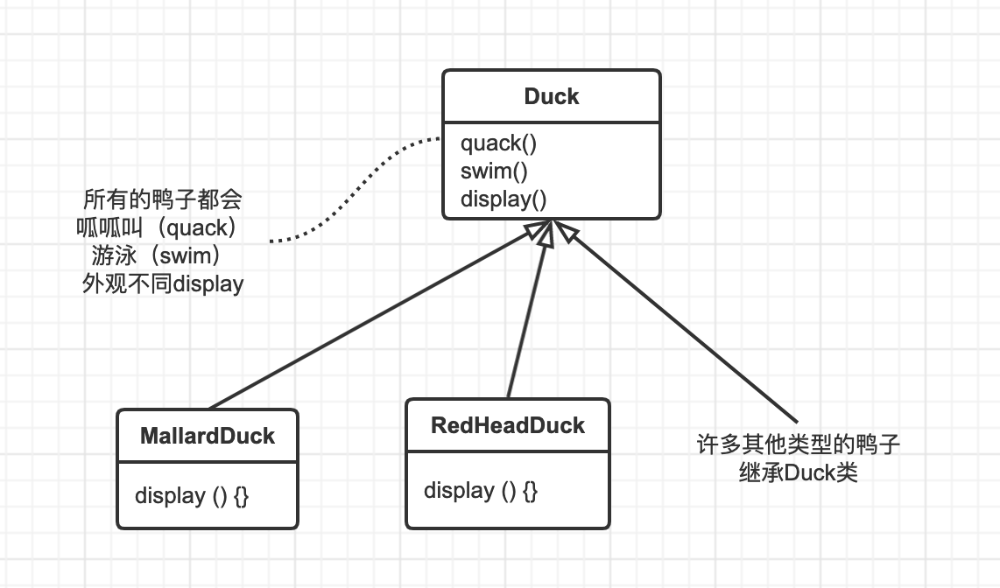
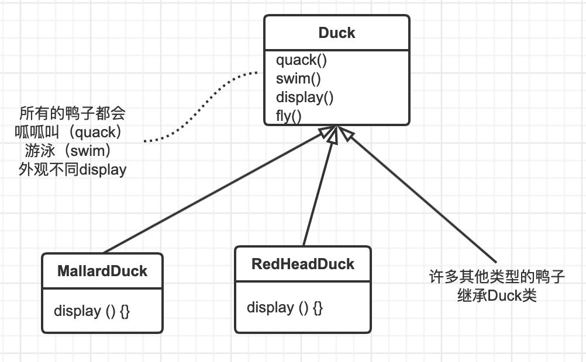
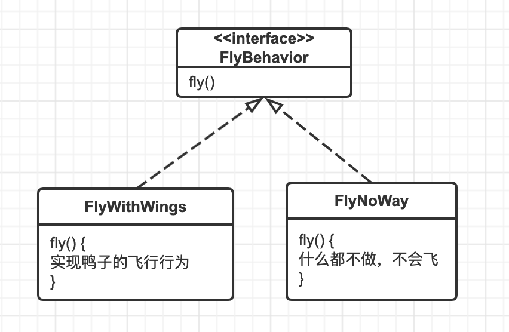
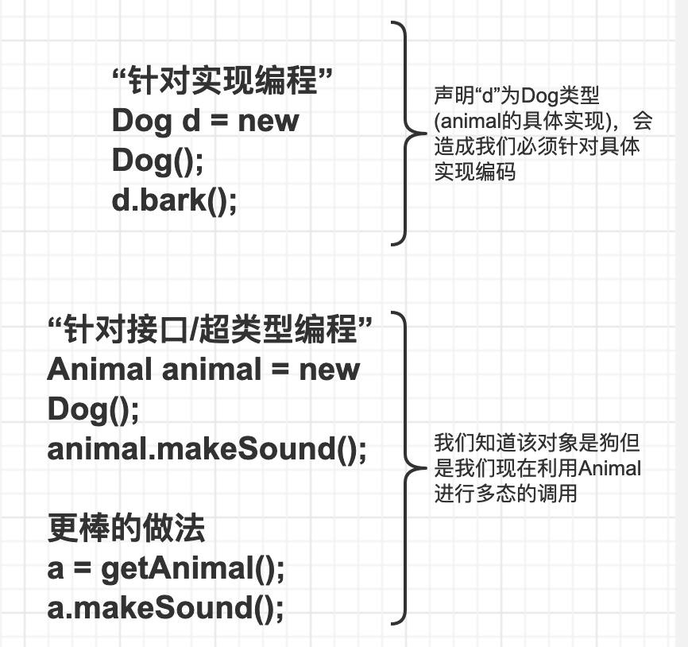
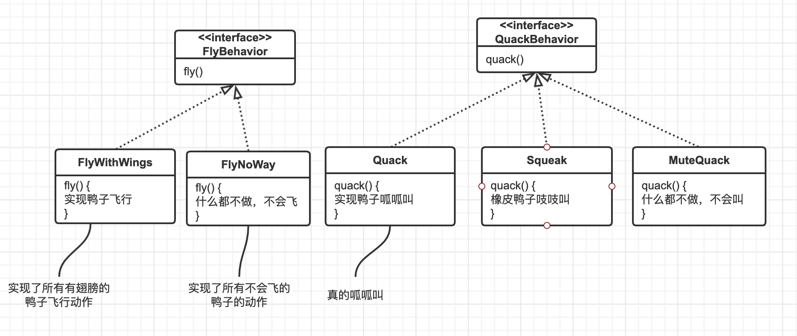
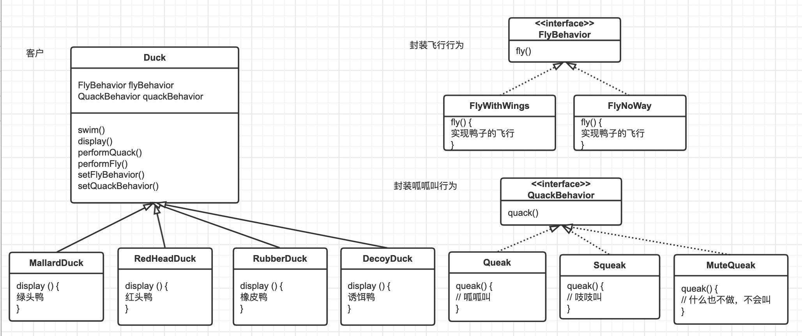

# 策略模式

### 简单的鸭子应用

模拟鸭子游戏：一边游泳一边呱呱叫。内部设计使用了标准的OO技术。设计了一个鸭子超类（SuperClass）

问：如果需要让鸭子飞起来？

答：在Duck类中加上fly方法，然后所有鸭子都继承fly()

可怕的问题出现了，“橡胶鸭子”也拥有飞行的功能

## 把问题归零....

我们知道使用继承并不能很好的解决问题，因为鸭子的行为在子类里不断地改变，并且让所有的子类都有这些行为是不恰当的。`Flyable`与`Quackable`接口一开始似乎还不错，解决了问题，但是Java接口不具有实现代码，所以继承接口无法达到代码的复用。这意味着无论何时你需要修改莫个行为。

有个*设计原则*，恰好适用于此状况。

> 设计原则：找出应用中可能需要变化之处，把它们独立出来，不要和那些不需要变化的代码混在一起。

## 设计鸭子的行为

`我们希望一切有弹性。`

我们应该在鸭子类中包含设定行为的方法，这样可以在“运行时”动态地“改变”鸭子的飞行行为。

第二个设计原则：

> 设计原则：针对接口编程，而不是针对实现编程。

利用接口代表每个行为，`FlyBehavior`与`QuackBehavior`,而行为的每个实现都将实现其中的一个接口。

鸭子的子类将使用接口(FlyBehavior与QuackBehavior)所表示的行为，所以实际的实现不会被绑死在鸭子的子类中。(特定的具体行为编写在实现了FlyBehavior与QuackBehavior的类中)

> "针对接口编程"真正的意思是“针对超类型编程”
这里的“接口”是一个“概念”，也是一种Java和interface构造。“针对接口编程”，关键在于多态。利用多态，程序可以针对超类型编程，执行时会根据实际状况执行到真正的行为，不会被绑死在超类型的行为上。“针对接口编程”更明确地说成“变量的声明类型应该是超类型，通常是一个抽象类或者是一个接口，这意味着，声明类时不用理会以后执行时的真正对象类型“

## 实现鸭子的行为

> 这样的设计，可以让飞行和呱呱叫的动作被其他的对象复用，因为这些行为已经与鸭子类无关了。而我们新增一些行为，不会影响到既有的行为类。也不会影响”使用“到飞行行为的鸭子类。

我们的鸭子模拟器的设计最终真题格局。

当将两个类结合使用，这就是组合(composition)。这种做法和”继承“不同的地方在于，鸭子的行为不是继承来的，而是和适当的行为对象”组合“来的。

第三个设计模式

> 设计模式： 多用组合，少用继承。

## 总结

第一个设计模式：也就是策略模式，

> 策略模式定义了算法族。分别封装起来，让它们之间可以互相转换，此模式让算法的变化独立于使用算法的客户。
